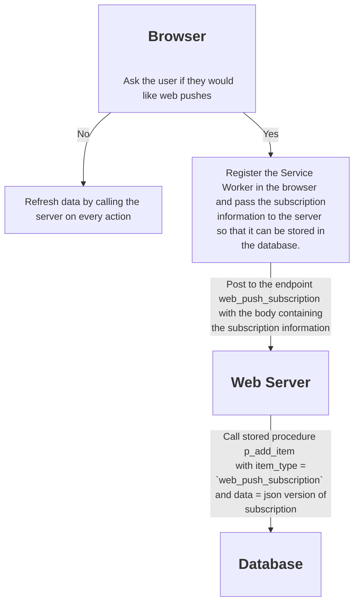
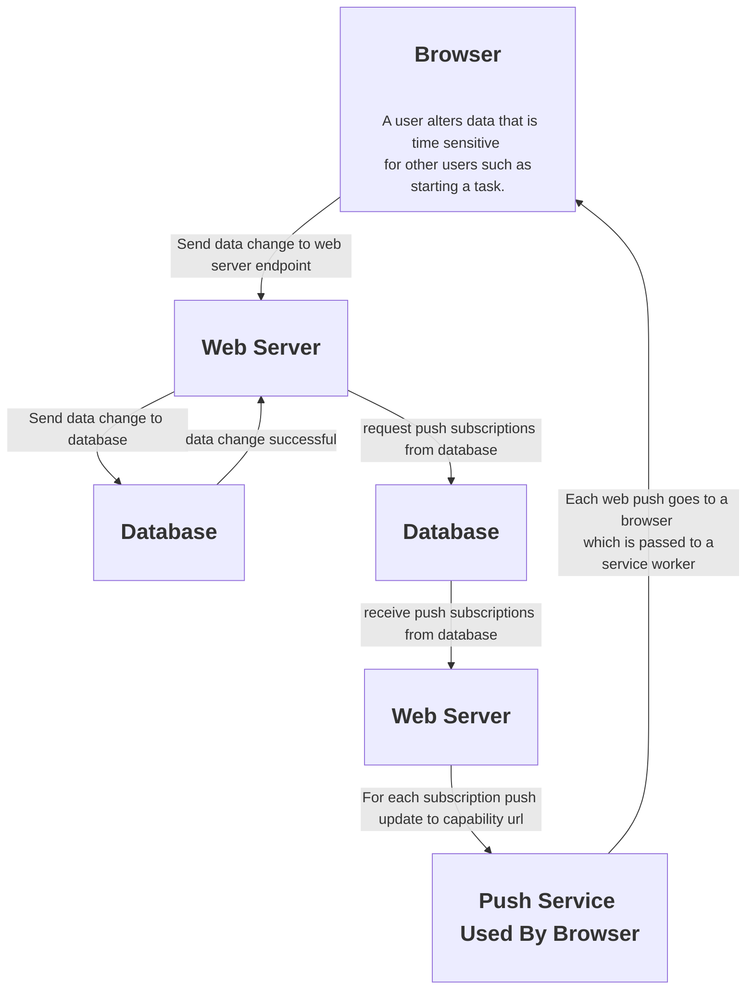

<h1 align="center">Life Helper Application</h1s>

## Table of contents

- [Table of contents](#table-of-contents)
- [Notes:](#notes)
- [Testing](#testing)
- [Diagrams](#diagrams)
  - [Web Push Subscription Process](#web-push-subscription-process)
  - [Web Push Process](#web-push-process)
- [Architecture](#architecture)
  - [AWS Implementation](#aws-implementation)
  - [Back End](#back-end)
  - [Installation of Root CA Created on the Linux Machine into Chrome on Windows](#installation-of-root-ca-created-on-the-linux-machine-into-chrome-on-windows)
  - [Network Configuration in Lieu of DNS](#network-configuration-in-lieu-of-dns)
  - [Switch Between Previously Used Networks](#switch-between-previously-used-networks)
  - [Configure a New Network](#configure-a-new-network)
  - [TODO: to be integrated into this documentation.](#todo-to-be-integrated-into-this-documentation)

## Notes:

- On the windows machine the 2 Virtual Ethernet Adapter IP addresses are used by by the operating system to allow network access for the VMs. The "Wi Fi" address is the on that the application will use.
- Use the command `arp -a` to view all devices on the local network. The first list is the relevant list, the one associated with the Wi Fi interface. The other two are for VMs like Windows Subsystem for Linux. Here is the result 8/7/2024:
  
- I used the regex find pattern "[0-9]+\. \* \[ \]" to replace all occurrences of numbered checkboxes with hyphen checkboxes. The replacement pattern was "- [ ]"
- The expiration date on web push subscriptions is determined by the subscription service.
- [This](https://curlconverter.com/javascript/) is a great resource to convert curl commands to fetch API in JavaScript.

## Testing

## Diagrams

### Web Push Subscription Process



### Web Push Process



## Architecture

- The back end of the application is composed of an ExpressJS web server and a MySQL database server. For local development purposes they run on the same machine. The ExpressJS server provides https routes that the front end running on the browser can use to read from and write data from and to the database. Ultimately I would like to host the backend server, the database and the front end web server on AWS.
- The front end web server is a SolisJS based web application.

### AWS Implementation

- I am abandoning MongoDB Atlas because MongoDB will be [deprecating data API and https endpoints](https://www.mongodb.com/docs/atlas/app-services/data-api/data-api-deprecation/#std-label-data-api-deprecation) in September 2025.
- I am considering [this](https://docs.aws.amazon.com/AmazonRDS/latest/UserGuide/CHAP_MySQL.html) AWS cloud based database solution.
- [Here](https://medium.com/@t.unamka/connecting-to-an-rds-or-aurora-instance-in-a-private-subnet-using-a-jump-box-bastion-host-ba6201464b73) is a link that provides some relevant information concerning the AWS architecture.

### Back End

- Each data end point is handled by a branch of code in `server.js`. These endpoints are of the form .../get/[item name], .../add/[item name], .../delete/[item name] and .../update/[item name].
- Each data endpoint maps to a database call in `db.js`. Each database call is handled by a stored procedure in the database.
- Note that the database deletes are actually just logical deletes where the deleted_dtm column of a given item is updated to the current date time.

### Installation of Root CA Created on the Linux Machine into Chrome on Windows

- I needed to do this because I will sometimes (maybe always) run the web server on the linux machine and it will present a different root CA then the one that mkcert created on the windows machine.
- I used bluetooth to send it to the windows machine and renamed it to a .crt file.
- I then imported it into Chrome as follow. Open Chrome Settings and select Privacy and security --> Security --> Manage certificates --> Local certificates and then clicked "Manage imported certificates from Windows". I then clicked "Import" and then "Next", browsed to the file and imported it. Note that I think this may have resulted in the certificate being stored in the certificate manager as it is there and I do not remember putting it there. I am not sure.

### Network Configuration in Lieu of DNS

- Without DNS there are several hardcoded configuration values that need to be addressed.

- Express server:
  - The IP address and port to which the web server is listening needs to be put in the config file config.json.
    > "web_server_url": "https://192.168.1.164:3000"
- Application server:
  - The IP address and port to which the Express server is listening needs to be put in GlobalStateProvider.jsx.
- Service worker:
  - The IP address and port to which the Express server is listening needs to be put in service_worker.js.
    > here???

### Switch Between Previously Used Networks

There should be nothing to do unless the router decides to assign a new IP address to my laptop's Wi-Fi adapter.

- Express server:
  - The Express server detects the "Wi-Fi" address and uses the security certificate in the cert folder whose name matches the IP address.
- Application server:
  - The domain in GlobalStateProvider.jsx is hardcoded to the IP address port 3001.
- Service worker:
  - The domain is derived from event.target.registration.scope and data access is then sent to that domain on port 3001.

### Configure a New Network

- In the event that a network assigns a `Wi-Fi` IP address that has never been assigned before
  - Express Server: Use mkcert to create a security certificate for the new IP address and name the files that address and put them in the cert folder. For example, let's say on a new network the address assigned to my laptop is xxx.xxx.xxx.xxx:
  ```
  mkcert xxx.xxx.xxx.xxx
  ```
  will create a new pair of certificate files for the domain xxx.xxx.xxx.xxx. Rename these files (if necessary) and put them n the cert folder.

### TODO: to be integrated into this documentation.

- Currently, I have to do the following things every time I switch from one local network to another.
  - Express server:
    - Ensure the config.json entry matches the IP address and port the Life Helper front end is listening on to enable CORS.
  - Application server:
    - Ensure domain entry in GlobalStateProvider.jsx match the IP address and port that the Express Server back end is listening on.
  - Service worker:
    - Nothing. The front end sends the service worker a message when it starts up.
