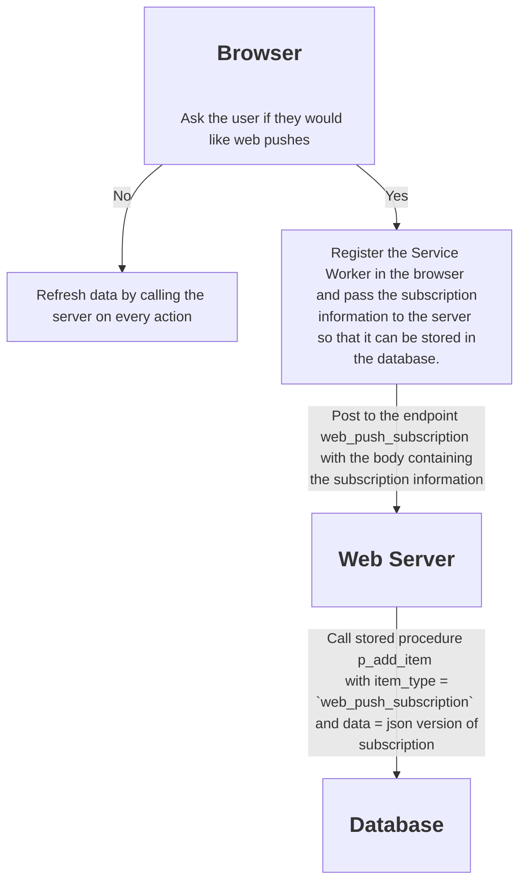
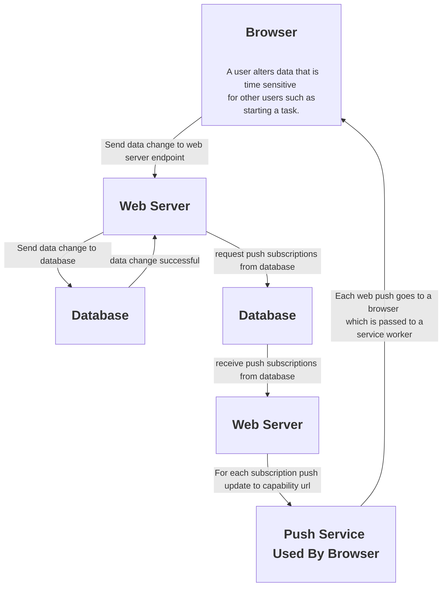

<h1 align="center">Life Helper Application</h1s>

## Table of contents

- [Table of contents](#table-of-contents)
- [Diagrams](#diagrams)
  - [Web Push Subscription Process](#web-push-subscription-process)
  - [Web Push Process](#web-push-process)
- [Architecture](#architecture)
  - [Back End](#back-end)
  - [Root CA Management](#root-ca-management)
  - [Configure an environment](#configure-an-environment)
  - [Future AWS Implementation](#future-aws-implementation)
- [Personal Notes](#personal-notes)

## Diagrams

### Web Push Subscription Process



### Web Push Process



## Architecture

- The back end of the application is composed of an ExpressJS web server and a MySQL database server. For local development purposes they run on the same machine. The ExpressJS server provides https routes that the front end running in the browser can use to read from and write data from and to the database.
- The front end web server is a SolisJS based web application running on a Vite server.

### Back End

- Each data end point is handled by a branch of code in `server.js`. These endpoints are of the form .../get/[item name], .../add/[item name], .../delete/[item name] and .../update/[item name].
- Each data endpoint maps to a database call in `db.js`. Each database call is handled by a stored procedure in the database.
- Note that the database deletes are actually just logical deletes where the deleted_dtm column of a given item is updated to the current date time.

### Root CA Management

- I created a root CA certificates for both the windows machine and the linux machine using `mkcert` using the following command:
  ```
  mkcert install
  ```
  mkcert makes every effort to put this certificate where it needs to go on the machine on which it was created but you may need to manually import it into a browser, import it into a credentials manager (windows) or place it in the file system (linux) in a special location if that does not happen.
- The relevant file is the one that begins "-----BEGIN CERTIFICATE-----".
- If you want to access the front end web server from another device then you need to manually distribute it to that device.
  - In the case of a laptop you can just import it into the browser you want to use. Just rename the file to the correct extension for the given browser. For example, to install the root CA certificate from the linux machine into chrome on the windows machine do the following:
    - Rename it so that it has a .CRT extension.
    - Open settings and go to Privacy and security --> Security --> Manage certificates --> Local certificates and then clicked "Manage imported certificates from Windows". Click "Import" and then "Next" and browse to the file and imported it.
  - In the case of an android phone do the following:
    - Rename it to a .PEM or .CRT file...I think Android accepts both.
    - Bluetooth the certificate to the phone.
    - Go to Settings --> Security and privacy --> More security settings --> Install from phone storage --> CA certificate and click the `Install Anyway` button. Enter a PIN if necessary and then click the "Downloads" folder and select the certificate file.
- If the front end web server is running on the linux machine the SSL certificate that Vite will present will reference the root CA certificate created on that machine. Likewise, if the front end web server is running on the windows machine the SSL certificate that Vite will present will reference the root CA certificate created on that machine.

### Configure an environment

- This configuration assumes there is no DNS resolution.
- Launch the Express Server on some machine and note the "Wi Fi" IP address and the port to which it is listening. This is the address to put in GlobalStateProvider.jsx of the front end web server. This tells the front end where the data can be accessed.
- Launch the front end web server on some machine, perhaps the same machine and note the "Wi Fi" IP address and the port to which it is listening. This is the address to put in the "web_server_url" node in the config.json file on the Express Server. This tells the backend what CORS is allowed.
- If the router assigns an address to the Express Server which is not covered by one of the existing certificates in the cert subdirectory then you will need to create a new on using mkcert. To do so use the following command:
  ```
  mkcert [some IP address like 123.456.7891]
  ```
  Now make sure the files have the same name as the IP address, in this case 123.456.7891 and put them in the cert folder.
- Service worker:
  - The IP address and port to which the Express server is listening on is provided to the service worker by the client, the web page, when needed. The only purpose the service worker currently has for this information is to log a web push subscription in the database. When the client, the web page, requests the service worker to do this it does so in a message that contains the relevant IP address and port.

### Future AWS Implementation

- I am considering [this](https://docs.aws.amazon.com/AmazonRDS/latest/UserGuide/CHAP_MySQL.html) AWS cloud based database solution.
- [Here](https://medium.com/@t.unamka/connecting-to-an-rds-or-aurora-instance-in-a-private-subnet-using-a-jump-box-bastion-host-ba6201464b73) is a link that provides some relevant information concerning the AWS architecture.

## Personal Notes

- On the windows machine the 2 Virtual Ethernet Adapter IP addresses are used by the operating system to allow network access for the VMs. The "Wi Fi" address is the one that the application will use.
- Use the command `arp -a` to view all devices on the local network.
- I used the regex find pattern "[0-9]+\. \* \[ \]" to replace all occurrences of numbered checkboxes with hyphen checkboxes. The replacement pattern was "- [ ]"
- The expiration date on web push subscriptions is determined by the subscription service.
- [This](https://curlconverter.com/javascript/) is a great resource to convert curl commands to fetch API in JavaScript.
