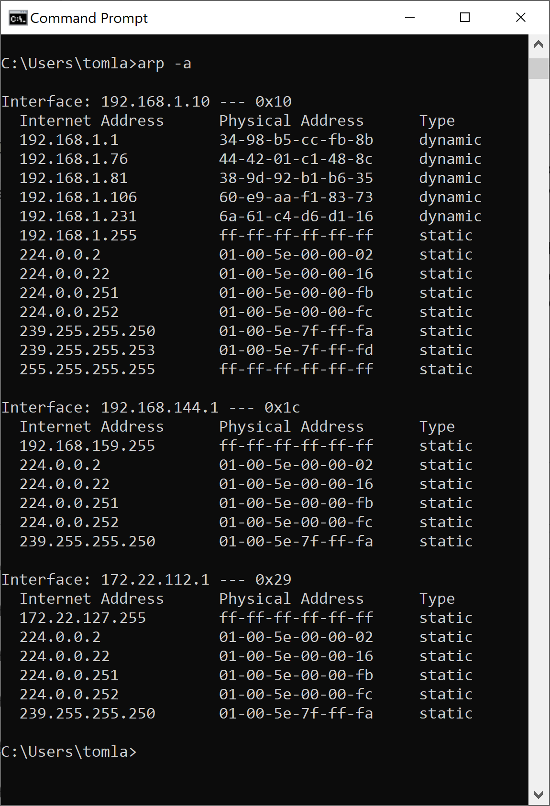
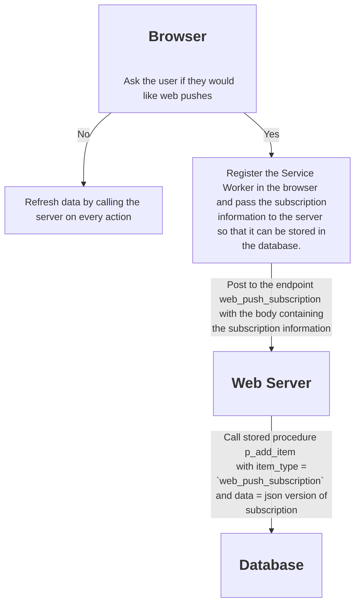
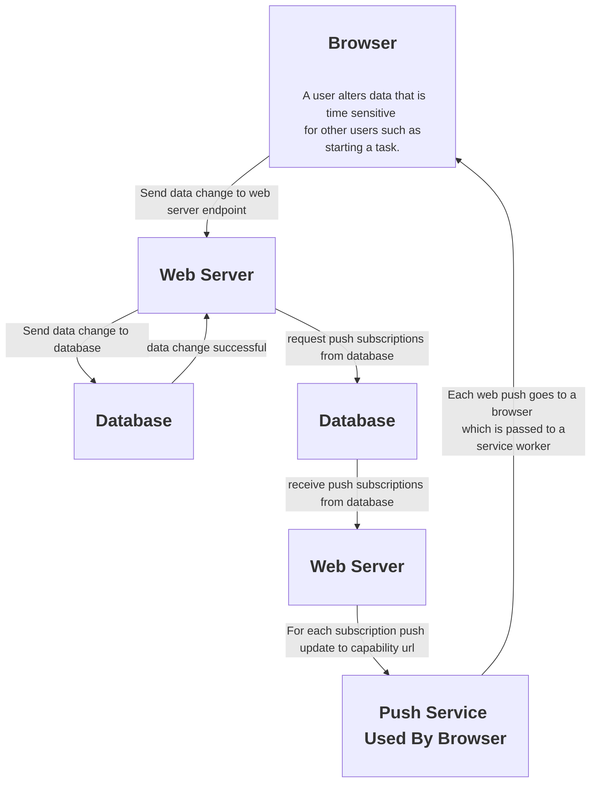

# Life Helper Application

## Notes:

1. I wrote that song on the fly so I had to use a very small font. Hah!
2. The 2 Virtual Ethernet Adapter IP addresses are used by by the operating system to allow network access for the VMs. I should just ignore them.
3. Use the command `arp -a` to view all devices on the local network. The first list is the relevant list, the one associated with the Wi Fi interface. The other two are for VMs like Windows Subsystem for Linux. Here is the result 8/7/2024:
   
4. I used the regex find pattern "[0-9]+\. \* \[ \]" to replace all occurrences of numbered checkboxes with hyphen checkboxes. The replacement pattern was "- [ ]"
5. The expiration date on web push subscriptions is read-only, determined by the subscription service.

## Testing

## TODOs

### Completed

- [x] Determine if the <!--- cspell:disable --> `pushsubscriptionchange` event
      is fired when the user unregisters <!--- cspell:enable --> the web push notification. IT DOES NOT.
- [x] For objectives page should be upper case O `Objectives`.
- [x] For Goals page should be `Goals for [objective name]`.
- [x] For Tasks page should be `Tasks for [goal name]`.
- [x] Provide a way to move up the Objective/Goal/Task stack.
- [x] Incorporate the service worker into the Life Helper app.
- [x] Send a web push notification from the Express Server app when a task is added.
- [x] Set web push subscription expired_dtm column to the current datetime if a 410 is received from the web push service.
- [x] Change `push_subscription` nomenclature to `web_push_subscription`
- [x] Change `notification` nomenclature to `web_push`.
- [x] Fold `p_save_push_subscription` into `p_add_items`.
- [x] default focus to add text box
- [x] Remove delete_type from object passed to deleteItem in sendWebPush error branch.
- [x] Replace unsubscribed_dtm and expired_dtm columns in web_push_subscription with a single column called unsubscribed_or_expired_dtm.
- [x] Alter p_delete_item to reflect this change.
- [x] Do not push to subscriptions which are no longer valid.
- [x] Only web push when an item is added or started.
- [x] Remove the Un-register button from the final version of the application.
- [x] Finish the `Switch between previously used networks` and `Configure for a new Network` portions of this document at the bottom.
- [x] Implement a strategy to discover/distribute the IP address to use across the three pieces of the application, the app itself, the express server and the service worker so that no configuration is necessary to switch between previously configured networks.
  - [x] Application: Discover the domain from window.location at startup.
  - [x] When a service worker is activated obtain the correct domain to use for the Express server from event.target.registration.scope.
  - [x] Express Server: Name the security certificate files the same as the hostname so that the express server knows which one to use at startup.
  - [x] Express Server: Only support the "Wi-Fi" address but retain a copy of the code that addresses CORS. Note, since the web server and the express server are on the same domain there should be NO CORS ISSUE. TEST THIS!!!
  - [x] When I get home see if I have a seamless transition from David's home network to mine. If not, rectify any issues.
  - [x] Finally, modify the`Switch between previously used networks` and `Configure for a new Network` portions of this document to reflect this new reality.

### Currently Being Implemented

- [ ] Replace the item text box with an "Add [a/an] [Objective/Goal/Task]" label/link". Focus no longer makes sense. See the "Add a comment" link [here](https://ux.stackexchange.com/questions/149929/text-box-max-character-limit-best-practice) as well as the question and associated answer. Create a modal solution which provides the user with two input controls. One to enter the item label and one to enter the item description. See the docs for the [Portal component](https://docs.solidjs.com/reference/components/portal#lessportalgreater). Make this a component and call it AddItem.
  - [x] Before proceeding change objective-goal-task.jsx to ProjectItem.jsx and change the component name from ItemFromImport to ProjectItem.
  - [x] Before proceeding stop prop drilling dataServer. Instead, use the GlobalState component wherever needed.
  - [x] Before proceeding put the refreshData and setRefreshData in the GlobalState component.
  - [x] Use the `data-` preface when adding any attributes to an html element.
  - [x] Do not use the event object in the function affectItem to obtain the values to be passed to the database. Instead, pass an object called `data` as a parameter. Note that this change affects this component, AddItem, and also affects the ProjectItem component.
    - [x] Implement `add` in AddItem component
    - [x] Change `start` and `delete` in ProjectItem component.
- [x] Push this version to Github

### Yet To Be Implemented

- [ ] Escape quotes in strings when inserting or updating data.
- [ ] Complete "Testing" section of this document
- [ ] Make Life Helper my signature app. The one that `boldly goes where only a few hundred million have gone before.`
- [ ] Consider changing its name to multi-user task management app leveraging push technology for time sensitive updates.
- [ ] Write code to handle <!--- cspell:disable --> pushsubscriptionchange <!--- cspell:enable --> event in service worker. I
      can test this by making the expiration date just a few minutes in the future.
- [ ] When a service worker is un-registered it should be marked as such by setting the “unregistered_dtm” column value to the current datetime. Test this by using the application to unregister the service worker.
- [ ] Use <!--- cspell:disable --> [Pushpad](https://pushpad.xyz/blog/web-push-error-410-the-push-subscription-has-expired-or-the-user-has-unsubscribed) as an example of how to engineer the service worker experience. Soon after you open this page a non-modal dialog appears asking the viewer if they would like to stay informed about Pushpad through notifications. Note, I placed the pushpad.js file, the file that appears to wrap all this functionaity, in the same directory as this document. See the code I added to index.js async function requestNotificationPermission() to see if I can customize the notification permission request message when I create a new subscription. <!--- cspell:enable -->
- [ ] Engineer the experience of the broader application if the user `does not` accept push notifications.
- [ ] Engineer the experience of the broader application if the user `does` accept push notifications.
- [ ] When the application receives a web push notification about a task being added it should respond by adding the task to the cache or other persistent storage such as indexed database, etc. See the [Storage API](https://developer.mozilla.org/en-US/docs/Web/API/Storage_API) for information about the options.
- [ ] Get rid of the unused CSS in index.css borrowed from MDN.
- [ ] Look at Github repos <!--- cspell:disable --> “sw-precache” <!--- cspell:enable --> and “offline-plugin”. See this for the links and other info.

## Diagrams

### Web Push Subscription Process



### Web Push Process



## Architecture

1. The back end of the application is composed of an Express web server with endpoints that enable the front end to read from and write data to a MySQL database. This application is located at D:\Computer Science\Original Applications\Express Server.
1. The front end is a SolisJS based web application. This application is located at D:\Computer Science\Original Applications\Life Helper.
1. The documentation and schema for the application are located at D:\Computer Science\Original Applications\Life Helper Docs and Schema.

### Back End

1. Each end point is handled by a branch of code in `server.js`. These endpoints are of the form .../get/[item name], .../add/[item name], .../delete/[item name] and .../update/[item name].
1. Each endpoint maps to a database call in `db.js`. Each database call is handled by a stored procedure in the database.
1. Note that the database deletes are actually just logical deletes where the deleted_dtm column of a given item is updated to the current date time.

### Switch between previously used networks:

There should be nothing to do unless the router decides to assign a new IP address to my laptop.

- Express server:
  - The Express server detects the "Wi-Fi" address and uses the security certificate in the cert folder whose name matches the IP address.
- Application server:
  - The domain in GlobalStateProvider.jsx is derived from window.location.hostname and data access is then sent to that domain on port 3001.
- Service worker:
  - The domain is derived from event.target.registration.scope and data access is then sent to that domain on port 3001.

### Configure for a new Network

If a network has not been used before do the following:

- Use `ipconfig` to determine the `Wi-Fi` IP address assigned to my laptop. If a certificate with that address already exists there is nothing to do.
- If not, use mkcert to create a security certificate for that IP address and name the files that address and put them in the cert folder. For example, let's say on a new network the address assigned to my laptop is xxx.xxx.xxx.xxx:
  ```
  mkcert localhost xxx.xxx.xxx.xxx
  or probably better,
  mkcert xxx.xxx.xxx.xxx
  ```
  will create a new certificate for the domain xxx.xxx.xxx.xxx.
