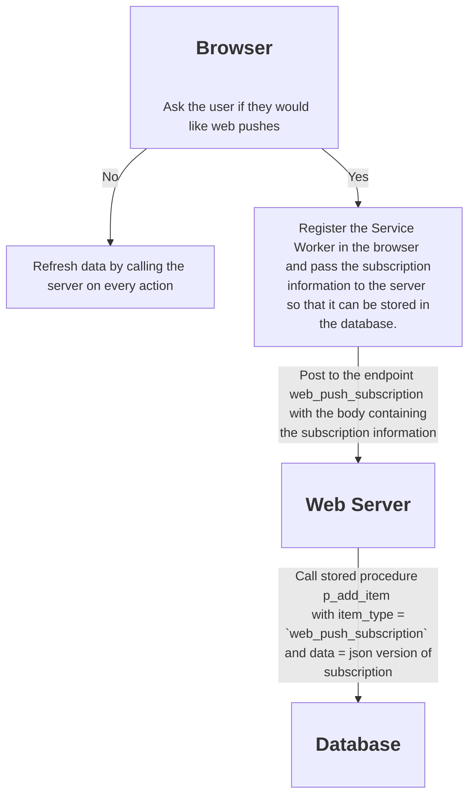
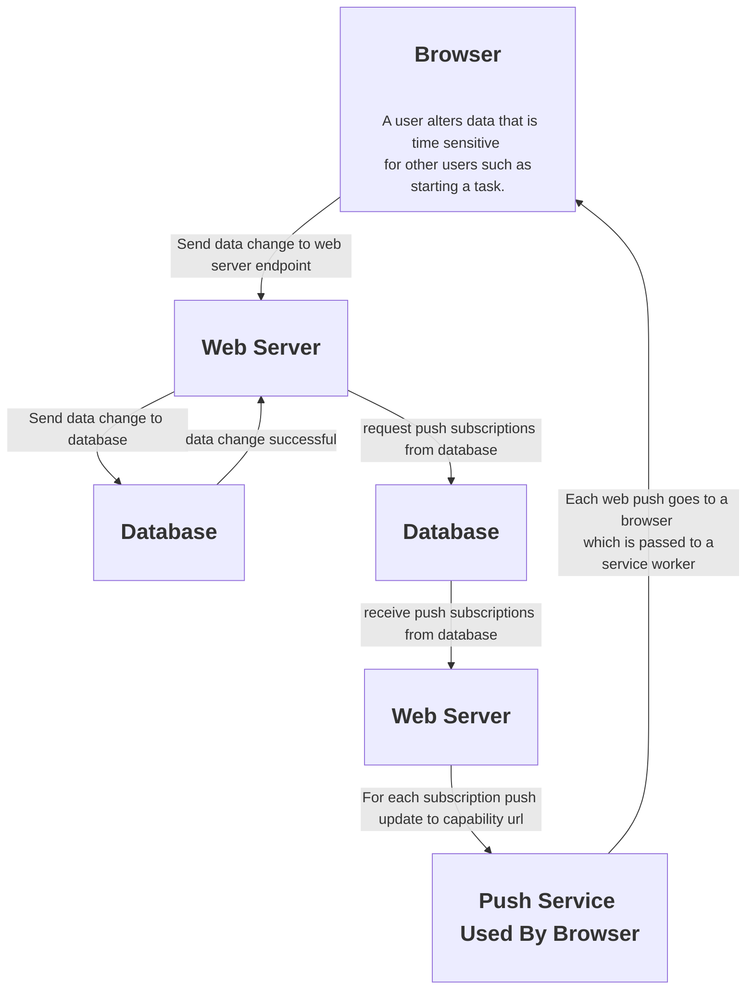

# Life Helper Application

## Diagrams

### Web Push Subscription Process

### Web Push Process

## Architecture

1. The back end of the application is composed of an Express web server with endpoints that enable the front end to read from and write data to a MySQL database. This application is located at D:\Computer Science\Original Applications\Express Server.
1. The front end is a SolisJS based web application. This application is located at D:\Computer Science\Original Applications\Life Helper.
1. The documentation and schema for the application are located at D:\Computer Science\Original Applications\Life Helper Docs and Schema.

### Back End
1. Each end point is handled by a branch of code in `server.js`. These endpoints are of the form .../get/[item name], .../add/[item name], .../delete/[item name] and .../update/[item name].
1. Each endpoint maps to a database call in `db.js`. Each database call is handled by a stored procedure in the database.
1. Note that the database deletes are actually just logical deletes where the deleted_dtm column of a given item is updated to the current date time.

### TODOs

#### Page title

1. [x] For objectives page should be upper case O `Objectives`.
1. [x] For Goals page should be `Goals for [objective name]`.
1. [x] For Tasks page should be `Tasks for [goal name]`.

#### Navigation

1. [x] Provide a way to move up the Objective/Goal/Task stack.

#### More TODOs...

1. [ ] default focus to add text box
2. [ ] Incorporate the service worker into the Life Helper app. Default to asking the user to accept. If they do not provide permission then have the app reload all items on each update, otherwise, use the service worker to keep the data fresh. Note how [Pushpad](https://pushpad.xyz/blog/web-push-error-410-the-push-subscription-has-expired-or-the-user-has-unsubscribed) does it. Soon after you open this page a non-modal dialog appears asking the viewer if they would like to stay informed about Pushpad through notifications. 
3. [ ] Get data from database to drive pushes in the Express Server app.
4. [ ] Remove a web push from the database if a 410 is received from web push service.
5. [x] Change `push_subscription` nomenclature to `web_push_subscription`
6. [ ] Change `notification` nomenclature to `web_push`.
7. [ ] Fold `p_save_push_subscription` into `p_add_items`. 
