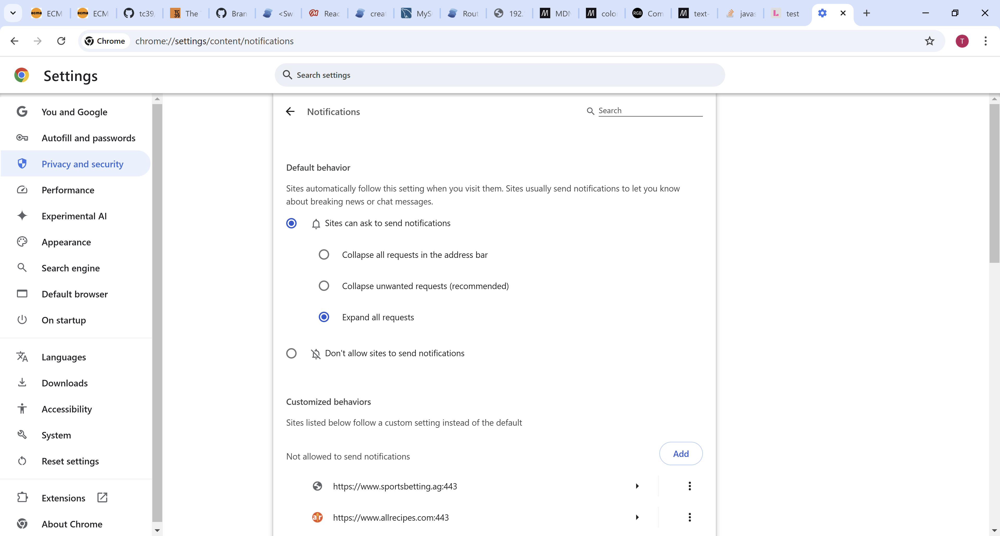

<h1 align="center">Life Helper Application</h1s>

## Table of contents

- [Table of contents](#table-of-contents)
- [Issues](#issues)
- [Diagrams](#diagrams)
  - [Web Push Subscription Process](#web-push-subscription-process)
  - [Web Push Process](#web-push-process)
- [Architecture](#architecture)
  - [Back End](#back-end)
  - [Database](#database)
    - [Database Upgrade Life Cycle](#database-upgrade-life-cycle)
    - [MySQL Workbench Compare Schemas](#mysql-workbench-compare-schemas)
    - [Test Driven Database Development](#test-driven-database-development)
    - [mysqlsh.exe](#mysqlshexe)
    - [Miscellaneous](#miscellaneous)
    - [Hierarchical versus web-like item structure](#hierarchical-versus-web-like-item-structure)
  - [Root CA Management](#root-ca-management)
  - [Configure an environment](#configure-an-environment)
  - [Future AWS Implementation](#future-aws-implementation)
- [Personal Notes](#personal-notes)

## Issues

- If a port is in use use the following command `in Powershell` to determine the process id of the process using the port. In this example we are checking port 3000.
  ```
  Get-Process -Id (Get-NetTCPConnection -LocalPort 3000).OwningProcess
  ```
  Then look up the process id in task manager to find the process. The easiest way to do this is to include pid in the columns and sort by pid.

## Diagrams

### Web Push Subscription Process


### Web Push Process


## Architecture

- The back end of the application is composed of an ExpressJS web server and a MySQL database server. For local development purposes they run on the same machine. The ExpressJS server provides https routes that the front end running in the browser can use to read from and write data from and to the database.
- The front end web server is a SolisJS based web application running on a Vite server.

### Back End

- Each data end point is handled by a branch of code in `server.js`. These endpoints are of the form .../get/[item name], .../add/[item name], .../delete/[item name] and .../update/[item name].
- Each data endpoint maps to a database call in `db.js`. Each database call is handled by a stored procedure in the database.
- Note that the database deletes are actually just logical deletes where the deleted_dtm column of a given item is updated to the current date time.

### Database

#### Database Upgrade Life Cycle

- When the schema needs to change then that change must first be applied to the testing database, test_life_helper, and tested.

  - The first step is to make the changes to the DDL and DML and tests.
    - For any database objects such as tables, stored procedures, triggers, foreign keys, etcetera that need to change, update the appropriate scripts.
    - For any new database objects create the appropriate scripts and add them to the `upgrade_and_test/create_test_environment.sh` shell script.
    - If there are any changes to the existing test scripts/objects then make them
    - If there are any new tests/objects then update the load_new_test_objects.sh and run_new_test.sh scripts appropriately.
  - The second step is to run the built in tests as follows:
    ```
    cd upgrade_and_test
    ./run_tests.sh -UnderAWhiteSky1 test_life_helper run_new_tests copy_from_production
    ```
    - The parameters have the following meaning:
      - 1st parameter: password
      - 2nd parameter: test schema
      - 3rd parameter: the value `run_new_tests` causes the new tests, if any, to be run and the value `do_not_run_new_tests` prevents them from being run.
      - 4th parameter: the value `copy_from_production` causes the test environment to be populated with a copy of the production data. Otherwise, the test environment contains no user entered data.
    - To run a baseline test to ensure that all existing database tests still pass with the given production data use the following:
      ```
      cd upgrade_and_test
      ./run_tests.sh -UnderAWhiteSky1 test_life_helper do_not_run_new_tests copy_from_production
      ```
    - To create an empty life_helper schema from the scripts and run only the existing tests use the following:
      ```
      cd upgrade_and_test
      ./run_tests.sh -UnderAWhiteSky1 test_life_helper do_not_run_new_tests
      ```
  - Finally, point the data server to test_life_helper to see how the application behaves against the new schema.

#### MySQL Workbench Compare Schemas

- The MySQL Workbench Compare Schemas capability can be used to compare databases.
  - To use the Compare Schemas capability use the menu option Database->Compare Schemas. Note that if this option is not available then open a New Modal using File->New Modal which should make the option available. See text files in the schema/bootstrap directory for the results. This provides a good high-level view.
  - I created the following scripts in the schema/bootstrap directory to give me very granular information about the differences between objects such as stored procedure and triggers in the two databases.
    - diff_stored_procedures.sql
    - diff_triggers.sql

#### Test Driven Database Development

- As of 1/16/2025 here are the list of available tests:
  - `p_task_and_goal_trigger_test_1`
  - `p_task_and_goal_trigger_test_2`
- `p_task_and_goal_trigger_test_1`: Test for task and goal update triggers. This test will ensure that the `started status` is properly propagated from tasks to goals to objectives.

  - Here is a diagram of the objective/goal/task structure for the test

    ```mermaid
    graph TD;
        A[<h2>Objective 1</h2>];
        B[<h2>Objective 2</h2>]-->D[<h3>Goal 1</h3>];
        C[<h2>Objective 3</h2>]-->D[<h3>Goal 1</h3>]; C-->E[<h3>Goal 2</h3>]
        D-->F[Task 1];
        D-->G[Task 2];
        E-->G[Task 2];
    ```

  - In this test `task 1 will be started`.
    - create all objectives goals and tasks
    - `expect` them to all be un-started
    - start task 1
    - `expect` goal 1, objective 2 and objective 3 to be started.
    - `expect` objective 1 and goal 2 to remain un-started.

- `p_task_and_goal_trigger_test_2`: Test for task and goal update triggers. This test will ensure that the `completed status` is properly propagated from tasks to goals to objectives.

  - Here is a diagram of the objective/goal/task structure for the test

    ```mermaid
    graph TD;
        A[<h2>Objective 1</h2>];
        B[<h2>Objective 2</h2>]-->D[<h3>Goal 3</h3>]; B-->E[<h3>Goal 1</h3>]
        C[<h2>Objective 3</h2>]-->E[<h3>Goal 1</h3>]; C-->F[<h3>Goal 2</h3>];
        D-->I[Task 3];
        E-->G[Task 1];
        E-->H[Task 2];
        F-->H[Task 2];
    ```

  - In this test `task 1 will be completed`.
    - create all objectives goals and tasks
    - start and complete task 2
    - `expect` them to all be un-completed except for goal 2
    - start and complete task 1
    - `expect` goal 1 and objective 3 to be completed.
    - `expect` objective 1, objective 2 and goal 3 to remain un-completed.

#### mysqlsh.exe

- Use the following syntax to use mysqlsh from the command line
  - `mysqlsh --mysqlx -u tlangan -h localhost -P 33060` or `mysqlsh mysql://tlangan@localhost:3306`
  - To pass the in the password use `mysqlsh --mysqlx -u tlangan -p-UnderAWhiteSky1 -h localhost -P 33060`
  - To execute a file in batch mode use the following syntax: `mysqlsh --mysqlx -u tlangan -p-UnderAWhiteSky1 -h localhost -P 33060 --file [some sql file name]`.
  - To check the status of the connection enter `shell.status()`
  - To exit from the session enter `\quit`

#### Miscellaneous

- `MySQL will create and index when a foreign key is created if it deems that that foreign key is not properly supported giving the existing indexes.` For example, consider the entity object_goal where the primary key/index is on object_id, goal_id. When I create the foreign key to objective MySQL does not create an index as the primary is already first indexed on object_id; however, when I create the foreign key to goal, MySQL creates a non-unique index on goal_id to assist in that relationship.
  - I created an analog for the indexes but I do not think it will be used. I did it as an exercise. The stored procedure is called `p_drop_all_non_primary_indexes`
- `Logging SQL Errors:` There is an entity called sql_error which initially is being used by p_drop_index to persist sql errors.
  - All stored procedures should contain an error handler that captures all exceptions. This is the syntax for that:
    ```
    DECLARE EXIT HANDLER FOR SQLEXCEPTION
        BEGIN
        ...
        rollback; /* If there is a transaction involved */
        insert into sql_error...
        END
    ```
    This design should ensure that no database errors are returned to the application.

#### Hierarchical versus web-like item structure

- I have as a goal to enable a web-like structure of connections between goals and objectives as well as between tasks and goals.
- This is ambitious but I believe it will prove very useful.

### Root CA Management

- I created a root CA certificates for both the windows machine and the linux machine using `mkcert` using the following command:
  ```
  mkcert install
  ```
  mkcert makes every effort to put this certificate where it needs to go on the machine on which it was created but you may need to manually import it into a browser, import it into a credentials manager (windows) or place it in the file system (linux) in a special location if that does not happen.
- The relevant file is the one that begins "-----BEGIN CERTIFICATE-----".
- If you want to access the front end web server from another device then you need to manually distribute it to that device.
  - In the case of a laptop you can just import it into the browser you want to use. Just rename the file to the correct extension for the given browser. For example, to install the root CA certificate from the linux machine into chrome on the windows machine do the following:
    - Rename it so that it has a .CRT extension.
    - Open settings and go to Privacy and security --> Security --> Manage certificates --> Local certificates and then clicked "Manage imported certificates from Windows". Click "Import" and then "Next" and browse to the file and imported it.
  - In the case of an android phone do the following:
    - Rename it to a .PEM or .CRT file...I think Android accepts both.
    - Bluetooth the certificate to the phone.
    - Go to Settings --> Security and privacy --> More security settings --> Install from phone storage --> CA certificate and click the `Install Anyway` button. Enter a PIN if necessary and then click the "Downloads" folder and select the certificate file.
- If the front end web server is running on the linux machine the SSL certificate that Vite will present will reference the root CA certificate created on that machine. Likewise, if the front end web server is running on the windows machine the SSL certificate that Vite will present will reference the root CA certificate created on that machine.

### Configure an environment

- This configuration assumes there is no DNS resolution.
- Launch the Express Server on some machine and note the "Wi Fi" IP address and the port to which it is listening. This is the address to put in GlobalStateProvider.jsx of the front end web server. This tells the front end where the data can be accessed.
- Launch the front end web server on some machine, perhaps the same machine and note the "Wi Fi" IP address and the port to which it is listening. This is the address to put in the "web_server_url" node in the config.json file on the Express Server. This tells the backend what CORS is allowed.
- If the router assigns an address to the Express Server which is not covered by one of the existing certificates in the cert subdirectory then you will need to create a new on using mkcert. To do so use the following command:
  ```
  mkcert [some IP address like 123.456.7891]
  ```
  Now make sure the files have the same name as the IP address, in this case 123.456.7891 and put them in the cert folder.
- Service worker:
  - The IP address and port to which the Express server is listening on is provided to the service worker by the client, the web page, when needed. The only purpose the service worker currently has for this information is to log a web push subscription in the database. When the client, the web page, requests the service worker to do this it does so in a message that contains the relevant IP address and port.
  - The last time I tried to exercise the service worker the "Sites can ask to send notifications" option was deselected and the option "Collapse unwanted requests (recommended)" as selected. This causes any request to send notifications to be immediately blocked. To fix this problem I selected the "Sites can ask to send notifications" option and the "Expand all requests" option. Image shown below.
    

### Future AWS Implementation

- I am considering [this](https://docs.aws.amazon.com/AmazonRDS/latest/UserGuide/CHAP_MySQL.html) AWS cloud based database solution.
- [Here](https://medium.com/@t.unamka/connecting-to-an-rds-or-aurora-instance-in-a-private-subnet-using-a-jump-box-bastion-host-ba6201464b73) is a link that provides some relevant information concerning the AWS architecture.

## Personal Notes

- I came across [this](https://webaim.org/resources/contrastchecker/) tool to analyze color contrast
- On the windows machine the 2 Virtual Ethernet Adapter IP addresses are used by the operating system to allow network access for the VMs. The "Wi Fi" address is the one that the application will use.
- Use the command `arp -a` to view all devices on the local network.
- Regex find and replace in VSCode
  - I used the find pattern `[0-9]+\.` in conjunction with the replace pattern `- [ ]` to replace this
    ````
    1. lorem ipsum
    2. Tom Langan
    3. Another list item
    ```
    with this
    ```
    - [ ] lorem ipsum
    - [ ] Tom Langan
    - [ ] Another list item
    ```
    ````
  - I used the find pattern `<a href=.+?>(\w\*)</a>` in conjunction with the replace pattern `$1` to replace this
    ```
    <li><a href="index.php">Home</a></li>
    <li><a href="about.php">About</a></li>
    <li><a href="contact.php">Contact</a></li>
    ```
    with this
    ```
    <li>Home</li>
    <li>About</li>
    <li>Contact</li>
    ```
- The expiration date on web push subscriptions is determined by the subscription service.
- [This](https://curlconverter.com/javascript/) is a great resource to convert curl commands to fetch API in JavaScript.
- The [W3C Markup Validator](https://validator.w3.org/#validate_by_input) is a very useful tool.
- [This](https://www.dell.com/community/en/conversations/xps/xps-15-7590-no-number-lock-key-for-special-characters/647f880af4ccf8a8de758f81) resource provides some guidance on using the hidden keyboard on my laptop
- I downloaded [MySQL Shell for VS Code](https://marketplace.visualstudio.com/items?itemName=Oracle.mysql-shell-for-vs-code). See [these](https://dev.mysql.com/doc/mysql-shell-gui/en/) instructions for the use of this tool.
  - This extension immediately complained about the version of the Microsoft C and C++ (MSVC) runtime library that was installed so I downloaded the latest version from [here](https://learn.microsoft.com/en-us/cpp/windows/latest-supported-vc-redist?view=msvc-170) and installed it. This is the version that was installed `Microsoft Visual C++ 2015-2022 Redistributable (x64) - 14.42.34433`. Note, the installer is in the downloads directory and it is called `VC_redist.x64.exe`.
  - Next the extension complained about a web certificate not being installed. This certificate is what allows https connections to the database from this tool. It is a root certificate authority installed locally (just like the one I created for Life Helper) to validate the access. According to the documentation is is stored here, %appdata%\MySQL\mysqlsh-gui\plugin_data\gui_plugin\web_certs\rootCA.crt which, in my case, maps to `C:\Users\tomla\AppData\Roaming\MySQL\mysqlsh-gui\plugin_data\gui_plugin\web_certs` and there are two certificates there, rootCA.crt and server.crt.
  - I am going to use MySQL workbench for now so I am going to disable this extension.S
