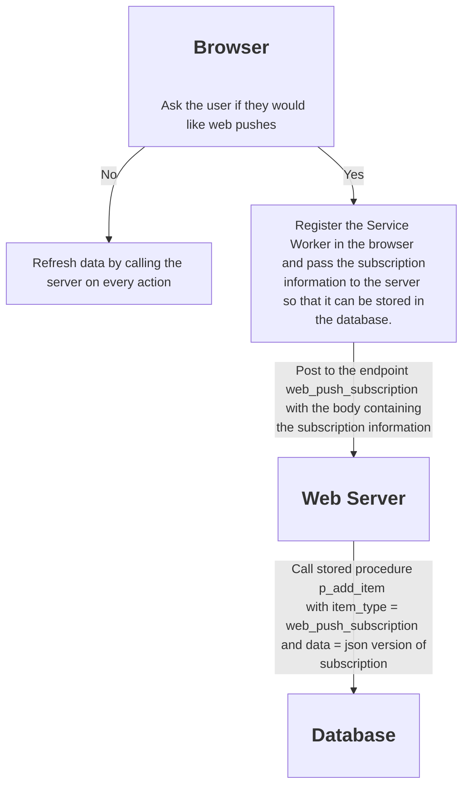
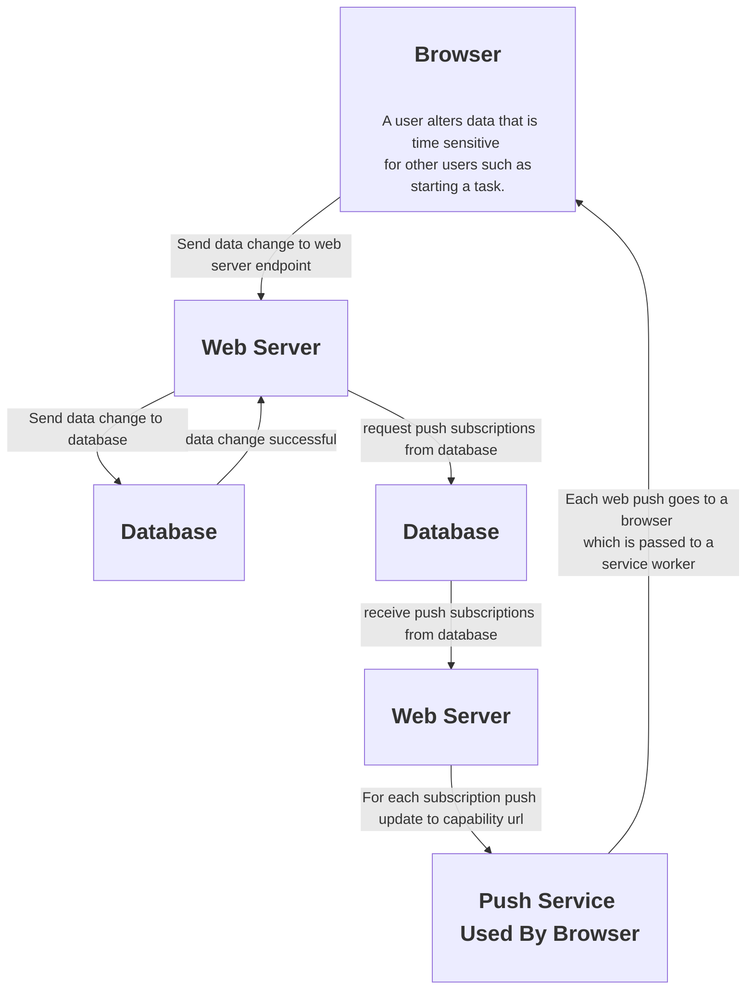
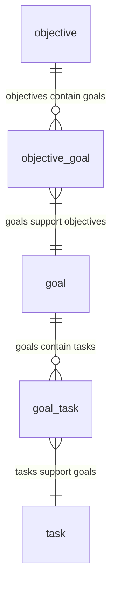
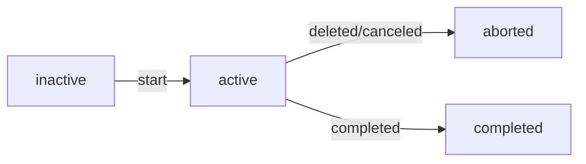
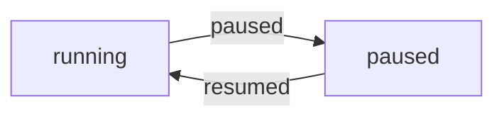
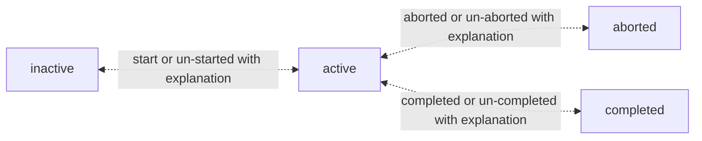
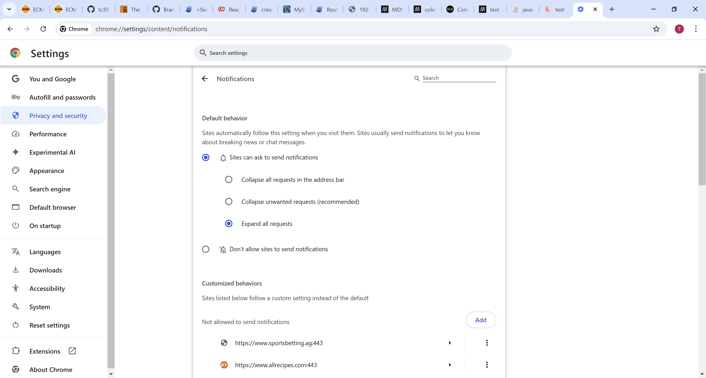

<h1 align="center">Life Helper Application</h1>
<p align="center">The app that boldly goes where only a few hundred million have gone before.</p>

## Table of contents

- [Table of contents](#table-of-contents)
- [Notes](#notes)
- [Issues](#issues)
- [Development Process](#development-process)
  - [Setup](#setup)
  - [Use](#use)
- [Diagrams](#diagrams)
  - [Web Push Subscription Process](#web-push-subscription-process)
  - [Web Push Process](#web-push-process)
- [Architecture](#architecture)
  - [Back End](#back-end)
  - [Database](#database)
  - [Tables](#tables)
  - [Complete ERD](#complete-erd)
  - [Users work tasks](#users-work-tasks)
  - [Users make notes](#users-make-notes)
  - [Database Upgrade Life Cycle](#database-upgrade-life-cycle)
    - [Development Environment](#development-environment)
    - [Production Environment](#production-environment)
  - [Test Driven Database Development](#test-driven-database-development)
  - [mysqlsh.exe](#mysqlshexe)
  - [Miscellaneous](#miscellaneous)
  - [Hierarchical versus web-like item structure](#hierarchical-versus-web-like-item-structure)
  - [Front End](#front-end)
    - [Current Application Behavior](#current-application-behavior)
    - [Potential Future Application Behavior](#potential-future-application-behavior)
    - [Registration \& Login](#registration--login)
  - [Root CA Management](#root-ca-management)
  - [Configure an environment](#configure-an-environment)
  - [Future AWS Implementation](#future-aws-implementation)
- [Web Push and Caching](#web-push-and-caching)
  - [Web Push](#web-push)
  - [Caching](#caching)
- [Abandoned Stuff](#abandoned-stuff)
  - [MySQL Workbench Compare Schemas](#mysql-workbench-compare-schemas)

## Notes

- I added a .gitattributes file to all the Life Helper repos. See [this](https://www.aleksandrhovhannisyan.com/blog/crlf-vs-lf-normalizing-line-endings-in-git/) very good explanation. This mechanism allows developers to work in different environments that generate different line endings, LF versus CRLF, but the repo only commits LF ended files to the repo. The file contains
  ```
  * text=auto
  ```
  To initialize an existing environment execute the following command.
  ```
  git add --renormalize .
  ```
- The expiration date on web push subscriptions is determined by the subscription service.

## Issues

- If a port is in use use the following command in `Powershell` to determine the process id of the process using the port. In this example we are checking port 3000.
  ```
  Get-Process -Id (Get-NetTCPConnection -LocalPort 3001).OwningProcess
  ```
  Then look up the process id in task manager to find the process. The easiest way to do this is to include pid in the columns and sort by pid.

## Development Process

### Setup

- During the development process it is often helpful to be able to create tasks or make notes, etcetera in the production database. Because it is awkward to re-point the data server to the production data environment and, depending on the current state of the data server code and the application code, may be impossible I am enabling the running of two life helper systems at the same time, one that interacts with the production database, life_helper, and one that interacts with the development database, test_life_helper.
- The cleanest implementation of this capability would require using the last committed code in both the data server and the application as stored on Github for the production environment. Run the following to set up that environment. You can click the `Run Command in terminal` link in the non-preview version of this file to execute these commands. The `Run Markdown Command Tom` extension is what enables this functionality.

  ```bash
  if [ "${PWD##*/}" != "Life Helper Docs and Schema" ]; then
    printf "Not in the correct directory"
    exit -1
  fi
  printf "In correct directory"
  cd ..
  rm -rf Production-Clones
  mkdir Production-Clones
  cd Production-Clones
  git clone https://github.com/tlangan1/Express-Server.git
  cd E*
  npm i
  cd ..
  git clone https://github.com/tlangan1/Life-Helper.git
  cd L*
  npm i
  cd ../..
  cd "Life Helper Docs and Schema"
  ```

### Use

- As of 4/4/2025 here are the instructions:
- `Express Server Setup`
  - Open the "Production-Clones/Express-Server" directory in VSCode.
  - Set the port to 3003 in server.js. This will not be necessary in the next version.
  - Set the port in config.json to 3002 and the database to life_helper. This will not be necessary in the next version.
  - Add the following command to the scripts node in package.json
    ```
        "prod": "nodemon --inspect server.js environment=prod",
    ```
    This will not be necessary in the next version.
  - Copy the certs directory from the local source into this directory. This will continue to be necessary as I do not want to store any certs on Github.
  - Open the "Production-Clones/Express-Server" directory in bash and execute the following command
    ```
    npm run prod
    ```
- `Life Helper Setup`
  - Open the "Production-Clones/Life-Helper" in VSCode and make the following changes:
    - Change the port in vite.config.js to 3002.
    - Change the port in the GlobalStateProvider component to 3003. This will not be necessary in the future.
  - Open the "Production-Clones/Life-Helper" directory in bash and execute the following command.
    ```
    npm run dev
    ```
- `Start the application`
  - Open a browser and go to https://192.168.1.10:3002/default-view

## Diagrams

### Web Push Subscription Process



### Web Push Process



## Architecture

- The back end of the application is composed of an ExpressJS web server and a MySQL database server. For local development purposes they run on the same machine. The ExpressJS server provides https routes that the front end running in the browser can use to read from and write data to the database.
- The front end web server is a SolisJS based web application running on a Vite server.

### Back End

- Each data end point is handled by a branch of code in `server.js`. These endpoints are of the form .../get/[item name], .../add/[item name], .../delete/[item name] and .../update/[item name].
- Each data endpoint maps to a database call in `db.js`. Each database call is handled by a stored procedure in the database.
- Note that the database deletes are actually just logical deletes where the deleted_dtm column of a given item is updated to the current date time.

### Database

### Tables

Core: goal, goal_task, objective, objective_goal, task,

Work/User: task_user, user_login, work_log

Notes: note, goal_note, objective_note, task_note

Web Push: web_push_subscription

Diagnostic: sql_error, trigger_log

### Complete ERD



### Users work tasks

- Here is a diagram of the relationship between users and tasks.

  ```mermaid
  erDiagram
    user_login ||--o{ task_user : "starts a task"
    task ||--o{ task_user : "typically this is one to one...see notes below"
    task_user ||--|{ work_log: "user works a task"
  ```

  - If a user is unable to complete a given task and it needs to get reassigned to another user then there would be two rows in task_user associated with that task.
  - A task can be reassigned only if it is in the started or paused state.
    - If a task is in the `paused state` then it can simply be reassigned.
    - If a task is in the `started state` then the reassignment logic should first pause it before reassigning it. In this way the time tracking logic can calculate the worked time for the original user assigned to the task.

### Users make notes

- Here is a diagram of the relationship between objectives, goals, tasks and notes.

  ```mermaid
  erDiagram
    objective ||--o{ objective_note : ""
    note ||--}| objective_note : "notes on an objective"
    goal ||--o{ goal_note : ""
    note ||--}| goal_note : "notes on a goal"
    task ||--o{ task_note : ""
    note |o--}| task_note : "notes on a task"
  ```

### Database Upgrade Life Cycle

#### Development Environment

- When the schema needs to change then that change should first be applied to the testing database, test_life_helper, and tested.
- The first step is to make the changes to the DDL and DML and tests.
  - For any database objects such as tables, stored procedures, triggers, foreign keys, etcetera that need to change, update the appropriate scripts. `They do NOT need to be loaded, that is taken care of by the scripts.
  - For any new database objects write the creation scripts and put them in the appropriate directories.
  - If there are any changes to the existing tests/objects then make them in the load_existing_test_objects.sh script. These are the tests which are executed by the run_existing_tests.sh script.
  - If there are any new tests/objects then update the load_new_test_objects.sh and run_new_test.sh scripts appropriately.
- The second step is to run the built in tests as follows:
  ```bash
  if [ "${PWD##*/}" != "Life Helper Docs and Schema" ]; then
    printf "Not in the correct directory"
    exit -1
  fi
  printf "In correct directory"
  cd schema
  cd upgrade_and_test
  ./run_tests.sh -UnderAWhiteSky1 test_life_helper run_new_tests
  cd ../..
  ```
  - The test script calls the database upgrade script which rebuilds the entire schema
  - The parameters have the following meaning:
    - 1st parameter: password
    - 2nd parameter: test schema
    - 3rd parameter: the value `run_new_tests` causes the new tests, if any, to be run and the value `do_not_run_new_tests` prevents them from being run.
  - To run a baseline test to ensure that all existing database tests still pass with the given production data use the following:
  ```
  cd schema
  cd upgrade_and_test
  ./run_tests.sh -UnderAWhiteSky1 test_life_helper do_not_run_new_tests
  ```
  - To create an empty life_helper schema from the scripts and run only the existing tests use the following:
  ```
  cd upgrade_and_test
  ./run_tests.sh -UnderAWhiteSky1 test_life_helper do_not_run_new_tests
  ```
- Finally, point the data server to the test_life_helper database to see how the application behaves against the new schema.
- Notes:

  - The upgrade script is a database creation script if the schema passed to it is not production, that is, `life_helper`.
  - The scripts/run.sh script is referenced in many of the shell scripts. It is just a thin wrapper around mysqlsh.exe calls to make the other scripts more readable.

#### Production Environment

- When satisfied with the behavior of the application upgrade the production environment with the following script.
  ```bash
  cd schema
  cd up*
  ./upgrade_or_create_environment.sh -UnderAWhiteSky1 life_helper
  cd ..
  cd ..
  ```

### Test Driven Database Development

- As of 1/16/2025 here are the list of available tests:
  - `p_task_and_goal_trigger_test_1`
  - `p_task_and_goal_trigger_test_2`
- `p_task_and_goal_trigger_test_1`: Test for task and goal update triggers. This test will ensure that the `started status` is properly propagated from tasks to goals to objectives.

  - Here is a diagram of the objective/goal/task structure for the test

    ```mermaid
    graph TD;
        A[<h2>Objective 1</h2>];
        B[<h2>Objective 2</h2>]-->D[<h3>Goal 1</h3>];
        C[<h2>Objective 3</h2>]-->D[<h3>Goal 1</h3>]; C-->E[<h3>Goal 2</h3>]
        D-->F[Task 1];
        D-->G[Task 2];
        E-->G[Task 2];
    ```

  - In this test `task 1 will be started`.
    - create all objectives goals and tasks
    - `expect` them to all be un-started
    - start task 1
    - `expect` goal 1, objective 2 and objective 3 to be started.
    - `expect` objective 1 and goal 2 to remain un-started.

- `p_task_and_goal_trigger_test_2`: Test for task and goal update triggers. This test will ensure that the `completed status` is properly propagated from tasks to goals to objectives.

  - Here is a diagram of the objective/goal/task structure for the test

    ```mermaid
    graph TD;
        A[<h2>Objective 1</h2>];
        B[<h2>Objective 2</h2>]-->D[<h3>Goal 3</h3>]; B-->E[<h3>Goal 1</h3>]
        C[<h2>Objective 3</h2>]-->E[<h3>Goal 1</h3>]; C-->F[<h3>Goal 2</h3>];
        D-->I[Task 3];
        E-->G[Task 1];
        E-->H[Task 2];
        F-->H[Task 2];
    ```

  - In this test `task 1 will be completed`.
    - create all objectives goals and tasks
    - start and complete task 2
    - `expect` them to all be un-completed except for goal 2
    - start and complete task 1
    - `expect` goal 1 and objective 3 to be completed.
    - `expect` objective 1, objective 2 and goal 3 to remain un-completed.

### mysqlsh.exe

- Use the following syntax to use mysqlsh from the command line
  - `mysqlsh --mysqlx -u tlangan -h localhost -P 33060` or `mysqlsh mysql://tlangan@localhost:3306`
  - To pass the in the password use `mysqlsh --mysqlx -u tlangan -p-UnderAWhiteSky1 -h localhost -P 33060`
  - To execute a file in batch mode use the following syntax: `mysqlsh --mysqlx -u tlangan -p-UnderAWhiteSky1 -h localhost -P 33060 --file [some sql file name]`.
  - To check the status of the connection enter `shell.status()`
  - To exit from the session enter `\quit`

### Miscellaneous

- `MySQL will create and index when a foreign key is created if it deems that that foreign key is not properly supported giving the existing indexes.` For example, consider the entity object_goal where the primary key/index is on object_id, goal_id. When I create the foreign key to objective MySQL does not create an index as the primary is already first indexed on object_id; however, when I create the foreign key to goal, MySQL creates a non-unique index on goal_id to assist in that relationship.
- `Logging SQL Errors:` There is an entity called sql_error which initially is being used by p_drop_index to persist sql errors.
  - All stored procedures should contain an error handler that captures all exceptions. This is the syntax for that:
    ```
    DECLARE EXIT HANDLER FOR SQLEXCEPTION
        BEGIN
        ...
        rollback; /* If there is a transaction involved */
        insert into sql_error...
        END
    ```
    This design should ensure that no database errors are returned to the application.

### Hierarchical versus web-like item structure

- The relationship between objectives goals and tasks is not strictly hierarchical. A goal may be required by one or more objectives and a task may be required by one or more goals.

### Front End

#### Current Application Behavior

- a task is `active` if it is started but not completed.
- a task is `inactive` if it is not `active, completed or aborted`.`
- A task can be deleted at any time before it is completed.



- An active task can be `paused` and `resumed`.



#### Potential Future Application Behavior

- A task can be un-started, un-aborted or un-completed but only with an explanation.



#### Registration & Login

- This section is accurate as of 3/22/2025
- Registration process
  - Conventional user name/password:
    - Some rules concerning required data and its format are enforced. Read the code for the details.
    - The `add/user_login` route is used to post the new user's data.
  - Federated: not yet implemented
  - Passkey: not yet implemented
- Login Process
  - Conventional user name/password:
    - A login can occur in the Login form.
    - A login can occur via a auto-login prompt. The auto-login is implemented with the option set that requires the user to interact, it is not done silently although it could be if the user has only one set of credentials for the Life Helper web site stored in the credentials manager.
    - In either case, the login function is used to implement the process.
    - The `check/user_login` route is used to post data to initiate the login request.
      - This process is implemented in such a way as to minimize the exposure of the password. To accomplish this the data server requests the user data from the database. The most relevant piece of data for the login process is the hashed password. The actual password is never sent to the database to isolate it from being captured in a logging event, etcetera. The bcrypt library then uses the actual password and the hashed password to determine if the actual password is correct and respond accordingly.
  - Federated: not yet implemented
  - Passkey: not yet implemented

### Root CA Management

- I created a root CA certificates for both the windows machine and the linux machine using `mkcert` using the following command:
  ```
  mkcert install
  ```
  mkcert makes every effort to put this certificate where it needs to go on the machine on which it was created but you may need to manually import it into a browser, import it into a credentials manager (windows) or place it in the file system (linux) in a special location if that does not happen.
- The relevant file is the one that begins "-----BEGIN CERTIFICATE-----".
- If you want to access the front end web server from another device then you need to manually distribute it to that device.
  - In the case of a laptop you can just import it into the browser you want to use. Just rename the file to the correct extension for the given browser. For example, to install the root CA certificate from the linux machine into chrome on the windows machine do the following:
    - Rename it so that it has a .CRT extension.
    - Open settings and go to Privacy and security --> Security --> Manage certificates --> Local certificates and then clicked "Manage imported certificates from Windows". Click "Import" and then "Next" and browse to the file and imported it.
  - In the case of an android phone do the following:
    - Rename it to a .PEM or .CRT file...I think Android accepts both.
    - Bluetooth the certificate to the phone.
    - Go to Settings --> Security and privacy --> More security settings --> Install from phone storage --> CA certificate and click the `Install Anyway` button. Enter a PIN if necessary and then click the "Downloads" folder and select the certificate file.
- If the front end web server is running on the linux machine the SSL certificate that Vite will present will reference the root CA certificate created on that machine. Likewise, if the front end web server is running on the windows machine the SSL certificate that Vite will present will reference the root CA certificate created on that machine.

### Configure an environment

- This description assumes that DNS resolution is not being used. This is for development purposes only.
- Launch the Express Server on some machine and note the "Wi Fi" IP address and the port to which it is listening. This is the address to put in GlobalStateProvider.jsx of the front end web server. This tells the front end where the data can be accessed.
- Launch the front end web server on some machine, perhaps the same machine and note the "Wi Fi" IP address and the port to which it is listening. This is the address to put in the "web_server_url" node in the config.json file on the Express Server. This tells the backend what CORS is allowed from that origin.
- If the router assigns an address to the Express Server which is not covered by one of the existing certificates in the cert subdirectory then you will need to create a new on using mkcert. To do so use the following command:
  ```
  mkcert [some IP address like 123.456.7891]
  ```
  Now make sure the files have the same name as the IP address, in this case 123.456.7891 and put them in the cert folder.
- Service worker:
  - The IP address and port to which the Express server is listening on is provided to the service worker by the client, the web page. The only purpose the service worker currently has for this information is to log a web push subscription in the database. When the client, the web page, requests the service worker to do this it does so in a message that contains the relevant IP address and port.
  - The last time I tried to exercise the service worker the "Sites can ask to send notifications" option was deselected and the option "Collapse unwanted requests (recommended)" as selected. This causes any request to send notifications to be immediately blocked. To fix this problem I selected the "Sites can ask to send notifications" option and the "Expand all requests" option. Image shown below.
    

### Future AWS Implementation

- [ ] Move Life Helper to AWS
  - [ ] Implement the Life Helper schema in AWS [RDB](https://us-east-1.console.aws.amazon.com/rds/home?region=us-east-1).
    - [ ] Document the creation of this database in the AWS folder in a subfolder called `RDS database creation 9-25-2024`.
    - [ ] Use [this](https://duckduckgo.com/?q=how+to+use+AWS+secrets+for+a+RDS+database+call+from+an+S3+application&iax=videos&ia=videos&iai=https%3A%2F%2Fwww.youtube.com%2Fwatch%3Fv%3DNg_zi11N4_c) as a guide.
- I am considering [this](https://docs.aws.amazon.com/AmazonRDS/latest/UserGuide/CHAP_MySQL.html) AWS cloud based database solution.
- [Here](https://medium.com/@t.unamka/connecting-to-an-rds-or-aurora-instance-in-a-private-subnet-using-a-jump-box-bastion-host-ba6201464b73) is a link that provides some relevant information concerning the AWS architecture.

## Web Push and Caching

### Web Push

- Document the application behavior if a user `accepts a web push subscription`.
- Document the application behavior if a user `does not accepts a web push subscription`.

### Caching

- What to do about caching??? Ideas like the following:
  - When the application receives a web push notification about a task being added it should respond by adding the task to the cache or other persistent storage such as indexed database, etc. See the [Storage API](https://developer.mozilla.org/en-US/docs/Web/API/Storage_API) for information about the options.
  - Consider using Github repos “sw-precache” and “offline-plugin”.

## Abandoned Stuff

### MySQL Workbench Compare Schemas

- The MySQL Workbench Compare Schemas capability can be used to compare databases; however, I have found it to be problematic to use.
- Also associated with this effort were stored procedure and trigger diffing scripts. I do not think this to be necessary moving forward.
  - To use the Compare Schemas capability use the menu option Database->Compare Schemas. Note that if this option is not available then open a New Modal using File->New Modal which should make the option available. See text files in the schema/bootstrap directory for the results. This provides a good high-level view
  - The problem with the report that it produces is that the wording in its output is very misleading. The following are two examples. In the following examples the life_helper and test_life_helper databases were compared.
    - For example, consider this statement. My first thought when reading it is
      ```
      Table `life_helper`.`t_task_user` was created
      ```
      that the table t_task_user exists in the life_helper database but not in the test_life_helper database. `What it actually means is the opposite!` The table t_task_user exists in the test_life_helper database but not in the life_helper database.
    - For another example, consider this statement. It turns out that the only
      ```
      Table `life_helper`.`goal` was modified
      ```
      thing different about the two tables is that the auto-increment for the goal_id, the primary key, has a different value. Here is the output of the diff.
      ```
      $ diff life_help_goal.sql test_life_helper_goal.sql
        11c11
        < ) ENGINE=InnoDB AUTO_INCREMENT=32 DEFAULT CHARSET=utf8mb4 COLLATE=utf8mb4_0900_ai_ci;
        ---
        > ) ENGINE=InnoDB AUTO_INCREMENT=34 DEFAULT CHARSET=utf8mb4 COLLATE=utf8mb4_0900_ai_ci;
      ```
  - I created the following scripts in the schema/bootstrap directory to give me very granular information about the differences between objects such as stored procedure and triggers in the two databases.
    - diff_stored_procedures.sql
    - diff_triggers.sql
