<h1 align="center">Life Helper Application</h1>
<p align="center">The app that boldly goes where only a few hundred million have gone before.</p>

## Table of Contents

- [Overview](#overview)
- [Repository Layout](#repository-layout)
- [Application Behavior](#application-behavior)
  - [Core Model](#core-model)
  - [Current Task Behavior](#current-task-behavior)
  - [Potential Future Behavior](#potential-future-behavior)
- [Development Workflow](#development-workflow)
  - [Production-like Local Setup](#production-like-local-setup)
  - [Database Upgrade Lifecycle](#database-upgrade-lifecycle)
  - [Production Schema Upgrade](#production-schema-upgrade)
- [Architecture](#architecture)
  - [Back End](#back-end)
  - [Database](#database)
  - [Diagrams](#diagrams)
- [Testing](#testing)
- [Configuration](#configuration)
- [Registration and Login](#registration-and-login)
- [Web Push and Caching](#web-push-and-caching)
- [Future AWS Implementation](#future-aws-implementation)
- [Appendix](#appendix)
  - [SQL and Schema Notes](#sql-and-schema-notes)
  - [mysqlsh.exe](#mysqlshexe)
  - [Root CA Management](#root-ca-management)
  - [Abandoned Work](#abandoned-work)

## Overview

Life Helper is a web application and schema for tracking objectives, goals, tasks, notes, and time worked. The current repository is primarily the documentation and database schema repository for that system.

The application is built around three linked business objects:

- `objective`: the highest-level thing to accomplish.
- `goal`: a concrete dependency or milestone required by one or more objectives.
- `task`: the unit of work users actually perform and track.

Goals derive state from their tasks, and objectives derive state from their goals. For example, when a task is started, related goals may become started; when goals reach terminal states, related objectives may become completed or canceled.

## Repository Layout

Important top-level paths:

- `schema/`: table, trigger, foreign key, stored procedure, and upgrade/test scripts.
- `schema/upgrade_and_test/`: schema rebuild and test entry points.
- `schema/triggers/`: trigger definitions that propagate started, completed, and canceled states.
- `schema/stored_procedures/`: stored procedures used by the application.
- `schema/tables/`: table creation procedures.
- `root CA certificates/`: development certificates for cross-device local HTTPS testing.
- `README-make-sure-shell-files-are-executable.md`: shell execution notes.
- `contenteditable-divs-and-hyphens.md`: separate implementation notes.

## Application Behavior

### Core Model

- The system supports a web-like relationship between objectives, goals, and tasks.
- A goal may be required by more than one objective.
- A task may be required by more than one goal.
- Users can track start times, completion, cancellation, notes, and worked time.
- Goal state is derived from constituent tasks.
- Objective state is derived from constituent goals.

### Current Task Behavior

- A task is `active` if it is started but not completed.
- A task is `inactive` if it is not active, completed, or canceled.
- A task can be canceled at any time before it is completed.

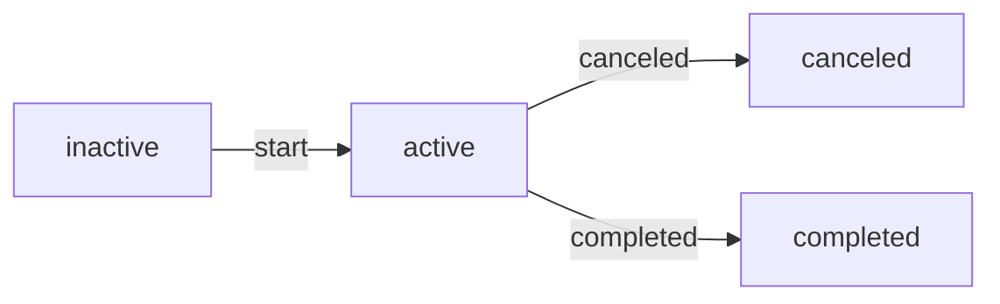
```mermaid
flowchart LR
    inactive -- "start" --> active
    active -- "canceled" --> canceled
    active -- "completed" --> completed
```

- An active task can be `paused` and `resumed`.

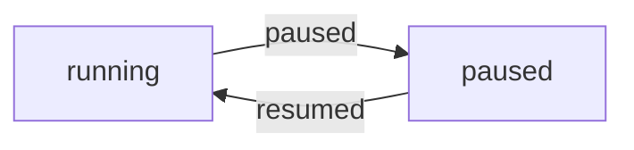
```mermaid
flowchart LR
    running -- "paused" --> paused
    paused -- "resumed" --> running
```

- A goal inherits its state from the tasks associated with it.

### Potential Future Behavior

- A task can be un-started, un-canceled, or un-completed, but only with an explanation.

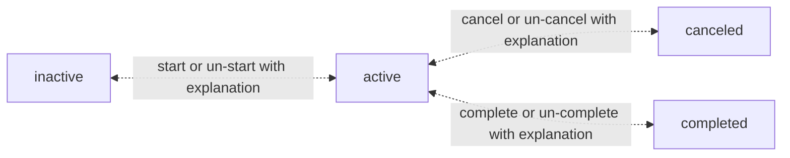
```mermaid
flowchart LR
    inactive <-. "start or un-start with explanation" .-> active
    active <-. "cancel or un-cancel with explanation" .-> canceled
    active <-. "complete or un-complete with explanation" .-> completed
```

## Development Workflow

### Production-like Local Setup

During development it is sometimes helpful to run two Life Helper environments at the same time:

- `life_helper`: production database.
- `test_life_helper`: development/test database.

The cleanest approach is to clone the application and data server into a separate `Production-Clones` directory and run those against the production database while this repository continues to drive schema development.

Run the following from the `Life Helper Docs and Schema` directory:

```bash
if [ "${PWD##*/}" != "Life Helper Docs and Schema" ]; then
  printf "Not in the correct directory"
  exit -1
fi
printf "In correct directory"
cd ..
rm -rf Production-Clones
mkdir Production-Clones
cd Production-Clones
git clone https://github.com/tlangan1/Express-Server.git
cd E*
npm i
cd ..
git clone https://github.com/tlangan1/Life-Helper.git
cd L*
npm i
cd ../..
cd "Life Helper Docs and Schema"
```

After the clones are created:

1. Copy the `certs` directory into `Production-Clones/Express-Server` so certificates are not stored in GitHub.
2. In `Production-Clones/Express-Server`, run:

   ```bash
   npm run prod_debug
   ```

3. In `Production-Clones/Life-Helper`, ensure `vite.config.js` points to port `3002`, then run:

   ```bash
   npm run dev
   ```

4. Use the `no_debug` launch for the production-like front end if you also need to debug the development version.
5. Open the application at `https://192.168.1.10:3002/default-view`.

### Database Upgrade Lifecycle

When the schema changes, apply and test it in `test_life_helper` first.

#### Step 1: Update scripts and tests

- Update the relevant scripts for changed tables, stored procedures, triggers, foreign keys, and other database objects.
- New objects only need creation scripts in the correct directories; the load scripts handle execution.
- If existing test objects need to change, update `load_existing_test_objects.sh`.
- If new tests are added, update `load_new_test_objects.sh` and `run_new_test.sh` as needed.

#### Step 2: Run the test schema rebuild and tests

```bash
if [ "${PWD##*/}" != "Life Helper Docs and Schema" ]; then
  printf "Not in the correct directory"
  exit -1
fi
printf "In correct directory"
cd schema
cd upgrade_and_test
./run_tests.sh -UnderSky1 test_life_helper run_new_tests
cd ../..
```

Notes:

- The test script rebuilds the entire schema.
- Parameters mean:
  - 1st parameter: password
  - 2nd parameter: schema name
  - 3rd parameter: `run_new_tests` or `do_not_run_new_tests`

To run only the existing tests:

```bash
cd schema
cd upgrade_and_test
./run_tests.sh -UnderSky1 test_life_helper do_not_run_new_tests
```

To create an empty `life_helper` schema from the scripts and run only the existing tests:

```bash
cd schema
cd upgrade_and_test
./run_tests.sh -UnderSky1 test_life_helper do_not_run_new_tests
```

After the schema and tests pass, point the data server at `test_life_helper` to observe application behavior against the new schema.

Additional notes:

- The upgrade script behaves as a database creation script when the schema is not production, meaning anything other than `life_helper`.
- `schema/scripts/run.sh` is a thin wrapper around `mysqlsh.exe` calls and is referenced by many shell scripts to keep them readable.

### Production Schema Upgrade

When satisfied with the behavior of the application, upgrade the production schema with:

```bash
cd schema
cd up*
./upgrade_or_create_environment.sh -UnderSky1 life_helper
cd ..
cd ..
```

Afterward, create fresh production-like clones using the process in [Production-like Local Setup](#production-like-local-setup).

## Architecture

The application uses:

- an ExpressJS web server for HTTPS API routes.
- a MySQL database server for persistence and business-rule enforcement.
- a SolisJS-based front end running on Vite.

### Back End

- Each data endpoint is handled by a branch in `server.js`.
- Each endpoint maps to a database call in `db.js`.
- Each database call is handled by a stored procedure in the database.
- Deletes are logical deletes rather than physical deletes.

### Database

#### Tables

- Core: `goal`, `goal_task`, `objective`, `objective_goal`, `task`
- Work/User: `task_user`, `user_login`, `work_log`
- Notes: `note`, `goal_note`, `objective_note`, `task_note`
- Web Push: `web_push_subscription`
- Diagnostic: `sql_error`, `trigger_log`

### Diagrams

#### Complete ERD

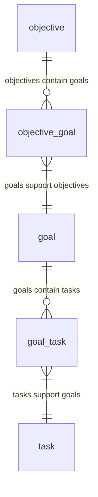
```mermaid
erDiagram
  objective ||--o{ objective_goal : "objectives contain goals"
  objective_goal }|--|| goal : "goals support objectives"
  goal ||--o{ goal_task : "goals contain tasks"
  goal_task }|--|| task : "tasks support goals"
```

#### Users Work Tasks

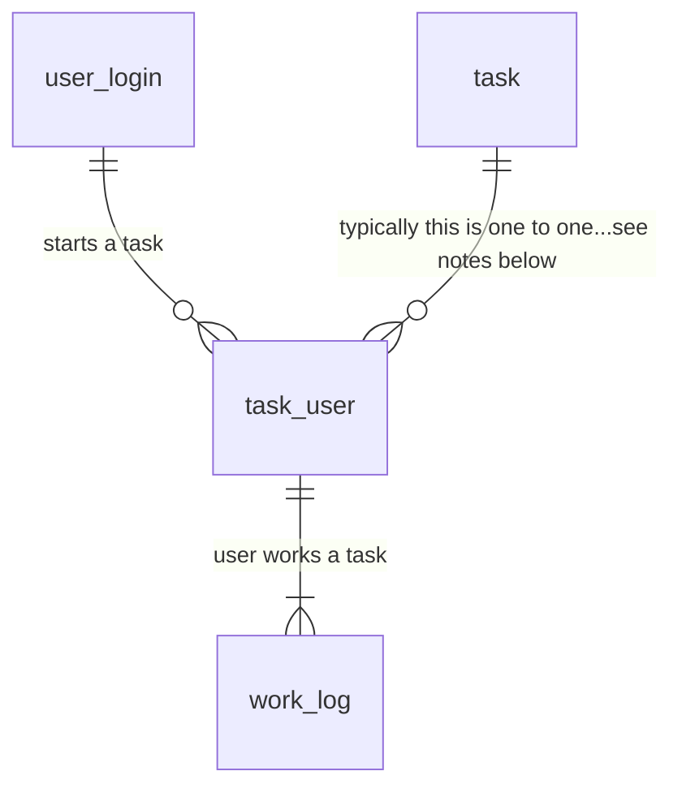
```mermaid
erDiagram
  user_login ||--o{ task_user : "starts a task"
  task ||--o{ task_user : "typically this is one to one...see notes below"
  task_user ||--|{ work_log: "user works a task"
```

Notes:

- If a user cannot complete a task and it needs reassignment, there may be at least two rows in `task_user` for that task.
- A task can be reassigned only if it is in the started or paused state.
- If a task is paused, it can simply be reassigned.
- If a task is started, reassignment should first pause it so worked time can be calculated correctly for the original assignee.
- Reassignment consists of inserting a new `task_user` row for the new user.

#### Users Make Notes

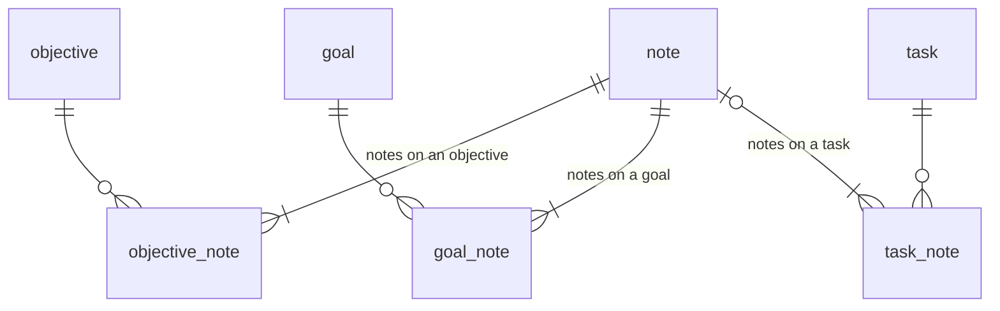
```mermaid
erDiagram
  objective ||--o{ objective_note : ""
  note ||--}| objective_note : "notes on an objective"
  goal ||--o{ goal_note : ""
  note ||--}| goal_note : "notes on a goal"
  task ||--o{ task_note : ""
  note |o--}| task_note : "notes on a task"
```

#### Web Push Subscription Process

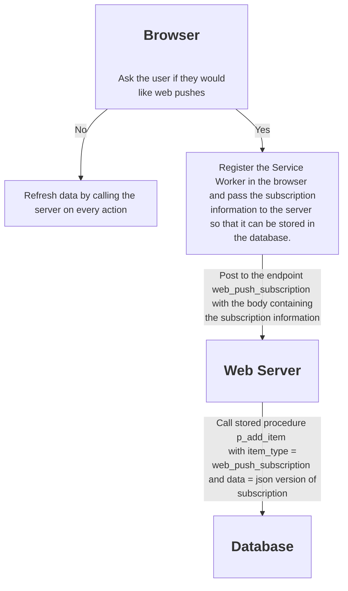
```mermaid
graph TD;
    A[<h2>Browser</h2> <br /> Ask the user if they would like web pushes] -- No --> B[Refresh data by calling the server on every action];
    A -- Yes --> C[Register the Service Worker in the browser <br /> and pass the subscription information to the server <br /> so that it can be stored in the database.]
    C -- Post to the endpoint web_push_subscription <br /> with the body containing the subscription information --> D[<h2>Web Server</h2>];
    D -- Call stored procedure p_add_item <br /> with item_type = web_push_subscription <br /> and data = json version of subscription --> E[<h2>Database</h2>]
```

#### Web Push Process

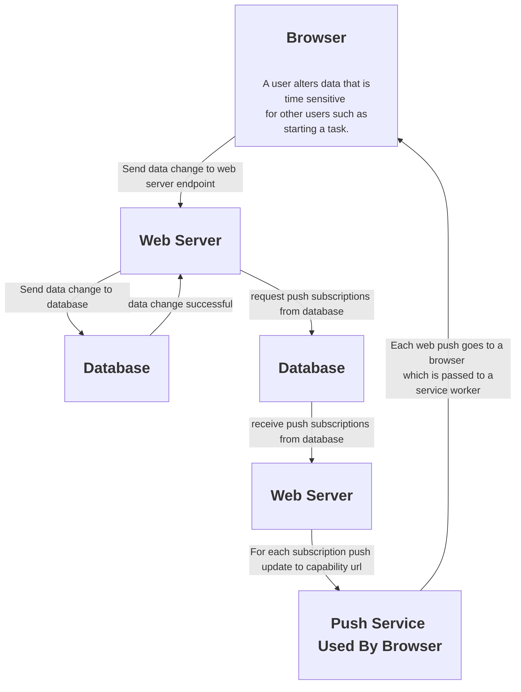
```mermaid
graph TD;
    A[<h2>Browser</h2> <br /> A user alters data that is time sensitive <br /> for other users such as starting a task.] -- Send data change to web server endpoint --> B[<h2>Web Server</h2>];
    B -- Send data change to database --> C[<h2>Database</h2>];
    C -- data change successful --> B;
    B -- request push subscriptions from database --> D[<h2>Database</h2>];
    D -- receive push subscriptions from database --> E[<h2>Web Server</h2>];
    E -- For each subscription push update to capability url --> F[<h2>Push Service Used By Browser</h2>];
    F -- Each web push goes to a browser <br /> which is passed to a service worker --> A
```

## Testing

As of `1/16/2025`, the available documented tests are:

- `p_task_and_goal_trigger_test_1`
- `p_task_and_goal_trigger_test_2`
- `p_task_and_goal_trigger_test_3`
- `p_task_calculate_worked_time_test_1`

### `p_task_and_goal_trigger_test_1`

This test verifies that `started` state propagates from tasks to goals to objectives.

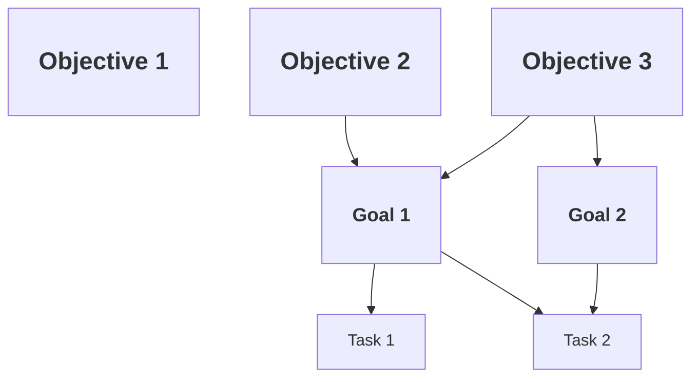
```mermaid
graph TD;
    A[<h2>Objective 1</h2>];
    B[<h2>Objective 2</h2>] --> D[<h3>Goal 1</h3>];
    C[<h2>Objective 3</h2>] --> D[<h3>Goal 1</h3>];
    C --> E[<h3>Goal 2</h3>]
    D --> F[Task 1];
    D --> G[Task 2];
    E --> G[Task 2];
```

Test sequence:

- create all objectives, goals, and tasks
- expect all to be un-started
- start task 1
- expect goal 1, objective 2, and objective 3 to be started
- expect objective 1 and goal 2 to remain un-started

### `p_task_and_goal_trigger_test_2`

This test verifies that `completed` state propagates from tasks to goals to objectives.

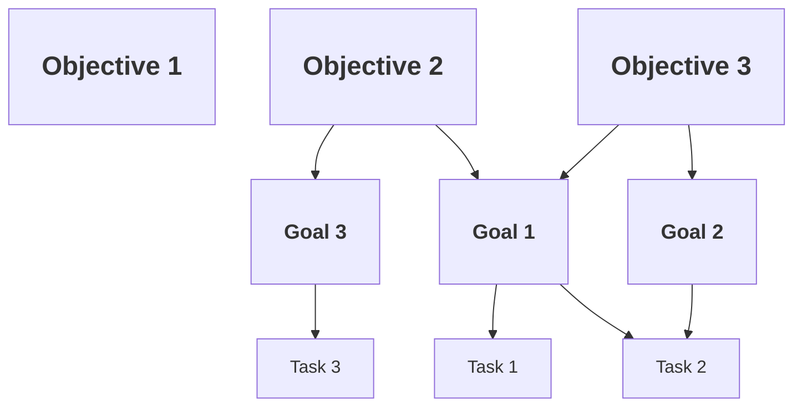
```mermaid
graph TD;
    A[<h2>Objective 1</h2>];
    B[<h2>Objective 2</h2>] --> D[<h3>Goal 3</h3>];
    B --> E[<h3>Goal 1</h3>]
    C[<h2>Objective 3</h2>] --> E[<h3>Goal 1</h3>];
    C --> F[<h3>Goal 2</h3>];
    D --> I[Task 3];
    E --> G[Task 1];
    E --> H[Task 2];
    F --> H[Task 2];
```

Test sequence:

- create all objectives, goals, and tasks
- start and complete task 2
- expect everything to remain un-completed except goal 2
- start and complete task 1
- expect goal 1 and objective 3 to be completed
- expect objective 1, objective 2, and goal 3 to remain un-completed

### `p_task_and_goal_trigger_test_3`

TODO: document this test.

### `p_task_calculate_worked_time_test_1`

TODO: document this test.

## Configuration

This description assumes DNS is not being used. It is intended for development only.

### Environment Wiring

1. Launch the Express Server and note the Wi-Fi IP address and port.
2. Put that address in `GlobalStateProvider.jsx` in the front end so the client knows where to find the data server.
3. Launch the front end web server and note its Wi-Fi IP address and port.
4. Put that origin in the `web_server_url` property in `config.json` on the Express Server so the backend allows CORS from that origin.

### Certificates

- If the router assigns the Express Server an address not covered by an existing certificate in the `cert` directory, create a new one with `mkcert`:

  ```bash
  mkcert [some IP address like 123.456.7891]
  ```

- Rename the generated files so they match the IP address and place them in the `cert` folder.

### Service Worker Notes

- The page provides the Express Server IP address and port to the service worker.
- The service worker currently uses that information primarily to log web push subscriptions in the database.
- If browser notification prompts are immediately blocked, check the browser notification settings. In one observed case, enabling `Sites can ask to send notifications` and `Expand all requests` resolved the issue.

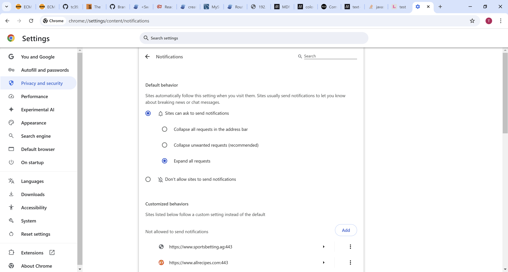

## Registration and Login

This section is accurate as of `3/22/2025`.

### Registration

- Conventional username/password:
  - Some validation rules concerning required data and formatting are enforced in code.
  - The `add/user_login` route is used to post the new user data.
- Federated: not yet implemented.
- Passkey: not yet implemented.

### Login

- Conventional username/password:
  - A login can occur in the login form.
  - A login can occur via an auto-login prompt.
  - Auto-login currently requires user interaction; it is not fully silent.
  - In either case, the login function implements the flow.
  - The `check/user_login` route is used to initiate the login request.
  - To reduce password exposure, the data server requests stored user data from the database and uses the hashed password for comparison. The plaintext password is not sent to the database.
- Federated: not yet implemented.
- Passkey: not yet implemented.

## Web Push and Caching

### Web Push

- Document the application behavior if a user accepts a web push subscription.
- Document the application behavior if a user does not accept a web push subscription.

### Caching

Open questions and possible directions:

- When the application receives a web push notification about a task being added, it could update local persistent storage such as IndexedDB.
- Review the [Storage API](https://developer.mozilla.org/en-US/docs/Web/API/Storage_API) for available browser-side options.
- Consider GitHub projects such as `sw-precache` and `offline-plugin`.

## Future AWS Implementation

- [ ] Move Life Helper to AWS
- [ ] Implement the Life Helper schema in AWS [RDS](https://us-east-1.console.aws.amazon.com/rds/home?region=us-east-1)
- [ ] Document the database creation process in an AWS folder, in a subfolder called `RDS database creation 9-25-2024`
- [ ] Use [this guide](https://duckduckgo.com/?q=how+to+use+AWS+secrets+for+a+RDS+database+call+from+an+S3+application&iax=videos&ia=videos&iai=https%3A%2F%2Fwww.youtube.com%2Fwatch%3Fv%3DNg_zi11N4_c) as a reference

Additional references:

- [AWS MySQL on RDS documentation](https://docs.aws.amazon.com/AmazonRDS/latest/UserGuide/CHAP_MySQL.html)
- [RDS/Aurora private subnet connectivity article](https://medium.com/@t.unamka/connecting-to-an-rds-or-aurora-instance-in-a-private-subnet-using-a-jump-box-bastion-host-ba6201464b73)

## Appendix

### SQL and Schema Notes

- MySQL may create an index when a foreign key is created if it decides the relationship is not adequately supported by existing indexes.
- Example: in `objective_goal`, if the primary key is indexed as `objective_id, goal_id`, MySQL may reuse that ordering for the foreign key to `objective` but create a separate non-unique index on `goal_id` for the foreign key to `goal`.

#### Logging SQL Errors

There is an entity called `sql_error` which is initially being used by `p_drop_index` to persist SQL errors.

Stored procedures should contain an error handler that captures exceptions, for example:

```sql
DECLARE EXIT HANDLER FOR SQLEXCEPTION
BEGIN
  ...
  rollback; /* If there is a transaction involved */
  insert into sql_error...
END
```

The intent is to prevent raw database errors from being returned directly to the application.

#### Notes and Issues

- `.gitattributes` was added to normalize line endings across environments. See [this explanation](https://www.aleksandrhovhannisyan.com/blog/crlf-vs-lf-normalizing-line-endings-in-git/).
- The file contains:

  ```text
  * text=auto
  ```

- To initialize an existing environment:

  ```bash
  git add --renormalize .
  ```

- The expiration date on web push subscriptions is determined by the subscription service.
- If a port is in use, PowerShell can identify the owning process. For example, to inspect port `3001`:

  ```powershell
  Get-Process -Id (Get-NetTCPConnection -LocalPort 3001).OwningProcess
  ```

### mysqlsh.exe

- Connect with either:
  - `mysqlsh --mysqlx -u tlangan -h localhost -P 33060`
  - `mysqlsh mysql://tlangan@localhost:3306`
- To pass the password inline:
  - `mysqlsh --mysqlx -u tlangan -p-UnderSky1 -h localhost -P 33060`
- To execute a file in batch mode:
  - `mysqlsh --mysqlx -u tlangan -p-UnderSky1 -h localhost -P 33060 --file [some sql file name]`
- To check connection status:
  - `shell.status()`
- To exit:
  - `\\quit`

### Root CA Management

- Root CA certificates were created for both the Windows and Linux machines using `mkcert install`.

  ```bash
  mkcert install
  ```

- `mkcert` usually installs the certificate where it is needed on the machine where it was created, but some browsers or devices may still require manual import.
- The relevant file is the one that begins with `-----BEGIN CERTIFICATE-----`.
- If you want to access the front end web server from another device, you need to distribute and install the root CA certificate on that device.

#### Import Notes

- Windows laptop / Chrome example:
  - rename the file to use a `.CRT` extension
  - open `Settings > Privacy and security > Security > Manage certificates > Local certificates`
  - choose `Manage imported certificates from Windows`
  - click `Import`, then browse to the certificate file
- Android phone example:

  - rename the file to `.PEM` or `.CRT`
  - transfer it to the phone
  - open `Settings > Security and privacy > More security settings > Install from phone storage > CA certificate`
  - click `Install Anyway`, enter a PIN if needed, and select the certificate file

- If the front end web server is running on Linux, the Vite SSL certificate references the Linux-created root CA certificate.
- If the front end web server is running on Windows, the Vite SSL certificate references the Windows-created root CA certificate.

### Abandoned Work

#### MySQL Workbench Compare Schemas

- MySQL Workbench can compare databases, but the results were found to be misleading enough that this path was abandoned.
- Stored procedure and trigger diffing scripts were also created as part of that effort and are not expected to be needed moving forward.

Workbench notes:

- Use `Database -> Compare Schemas`.
- If the option is unavailable, open a new model using `File -> New Model` and try again.
- See text files in `schema/bootstrap` for example results.

Examples of misleading output:

- `Table life_helper.t_task_user was created`
  - This actually meant the table existed in `test_life_helper` but not in `life_helper`.
- `Table life_helper.goal was modified`
  - In at least one case, the only actual difference was the auto-increment value.

Example diff:

```diff
$ diff life_help_goal.sql test_life_helper_goal.sql
  11c11
  < ) ENGINE=InnoDB AUTO_INCREMENT=32 DEFAULT CHARSET=utf8mb4 COLLATE=utf8mb4_0900_ai_ci;
  ---
  > ) ENGINE=InnoDB AUTO_INCREMENT=34 DEFAULT CHARSET=utf8mb4 COLLATE=utf8mb4_0900_ai_ci;
```

Supporting scripts created in `schema/bootstrap`:

- `diff_stored_procedures.sql`
- `diff_triggers.sql`
